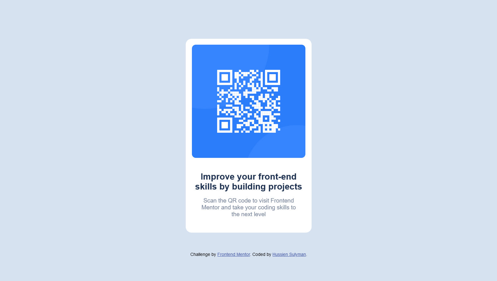

# Frontend Mentor - QR code component solution

This is a solution to the [QR code component challenge on Frontend Mentor](https://www.frontendmentor.io/challenges/qr-code-component-iux_sIO_H). Frontend Mentor challenges help you improve your coding skills by building realistic projects. 

## Table of contents

- [Overview](#overview)
  - [Screenshot](#screenshot)
- [My process](#my-process)
  - [Built with](#built-with)
  - [What I learned](#what-i-learned)
  - [Continued development](#continued-development)
  - [Useful resources](#useful-resources)
- [Author](#author)

**Note: Delete this note and update the table of contents based on what sections you keep.**

## Overview

### Screenshot




## My process

### Built with

- Semantic HTML5 markup
- CSS custom properties
- Flexbox
- CSS Grid
- Mobile-first workflow

### What I learned

I learned how to use flexbox property much effectively and use the CSS variables.
To see how you can add code snippets, see below:

```css
* {
  --light-gray: hsl(212, 45%, 89%);
}

.content{
  display: flex;
  align-items: center;
  align-content: center;
  flex-direction: column;
}
```

### Continued development

I will continue to learn and practice more and more specially with Javascript to be more professional in front-end development.

### Useful resources

- [First Resource (Arabic YouTube Channel)](https://www.youtube.com/@ElzeroAcademy) - This channel help me to learn and master HTML and CSS. It also has playlists for back-end and these playlists are very powerful and enough to master web development.
- [Second Resource (Arabic Website)](https://www.elzero.org) - This is an amazing website which helped me to practice about what I learned in the channel by the tasks in it.

## Author

- Frontend Mentor - [@hussiensulyman](https://www.frontendmentor.io/profile/hussiensulyman)
- Instagram - [@hussiensulyman](https://www.instagram.com/hussiensulyman/)
- Facebook - [@hussiensulyman](https://www.facebook.com/hussiensulyman)
- Twitter - [@hussiensulyman](https://twitter.com/hussiensulyman)
- GitHub - [@hussiensulyman](https://github.com/hussiensulyman)
- LinkedIn - [@hussiensulyman](https://www.linkedin.com/in/hussien-sulyman-87898b253/)
